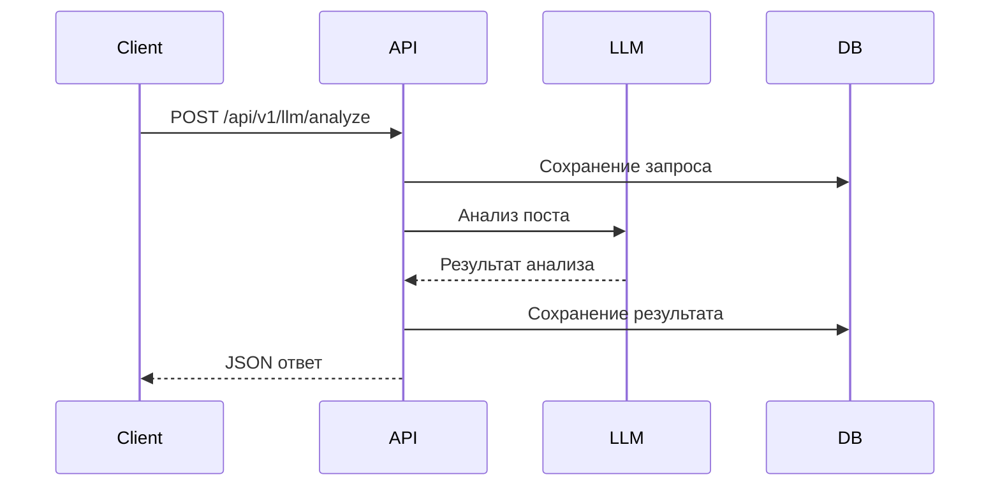
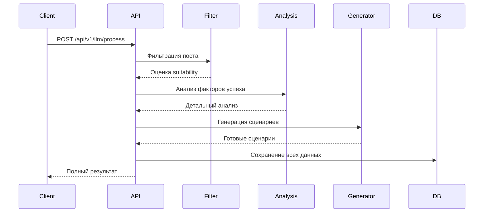

# 📡 API документация

## Обзор

ReAIboot предоставляет REST API для программного доступа ко всем функциям платформы. API построен на FastAPI и следует принципам RESTful архитектуры.

## Базовая информация

### **Базовый URL**
```
https://api.reai-boot.dev
```

### **Формат данных**
- **Request/Response**: JSON
- **Encoding**: UTF-8
- **Content-Type**: `application/json`

### **Аутентификация**
API использует несколько методов аутентификации:

1. **API Key** (рекомендуется для серверных приложений)
   ```
   X-API-Key: your_api_key_here
   ```

2. **Bearer Token** (для пользовательских сессий)
   ```
   Authorization: Bearer your_jwt_token
   ```

3. **Basic Auth** (только для административных функций)
   ```
   Authorization: Basic base64(username:password)
   ```

## Общие правила

### **HTTP Статусы**
| Код | Описание |
|-----|----------|
| 200 | Успешный запрос |
| 201 | Ресурс создан |
| 400 | Некорректный запрос |
| 401 | Не авторизован |
| 403 | Доступ запрещен |
| 404 | Ресурс не найден |
| 422 | Ошибка валидации |
| 429 | Слишком много запросов |
| 500 | Внутренняя ошибка сервера |

### **Обработка ошибок**
Все ошибки возвращаются в стандартном формате:

```json
{
  "success": false,
  "error": {
    "code": "ERROR_CODE",
    "message": "Человеко-читаемое описание ошибки",
    "details": {
      "field": "Конкретное поле с ошибкой",
      "value": "Проблемное значение"
    }
  },
  "timestamp": "2024-12-01T10:00:00Z",
  "request_id": "req_123456"
}
```

### **Пагинация**
Для эндпоинтов, возвращающих списки, используется курсорная пагинация:

```json
{
  "data": [...],
  "pagination": {
    "has_next": true,
    "next_cursor": "cursor_abc123",
    "limit": 50,
    "total": 1250
  }
}
```

**Параметры пагинации:**
- `limit` (integer, 1-100): Количество элементов на страницу
- `cursor` (string): Курсор для следующей страницы

### **Rate Limiting**
API имеет следующие ограничения:

| Эндпоинт | Лимит | Период | Заголовки ответа |
|----------|--------|--------|------------------|
| Анализ постов | 100 | час | `X-RateLimit-Remaining` |
| Генерация сценариев | 50 | час | `X-RateLimit-Remaining` |
| Получение данных | 1000 | час | `X-RateLimit-Remaining` |

### **Версионирование**
API использует семантическое версионирование в URL:
- Текущая версия: `v1`
- Формат: `/api/v1/endpoint`

## SDK и библиотеки

### **Python клиент**
```python
from reai_boot_client import ReAIbootClient

client = ReAIbootClient(api_key="your_api_key")
posts = client.get_viral_posts(channel="@example")
```

### **JavaScript/Node.js**
```javascript
const { ReAIbootAPI } = require('reai-boot-js');

const api = new ReAIbootAPI({ apiKey: 'your_api_key' });
const result = await api.analyzePost(postData);
```

### **cURL примеры**
```bash
# Получение списка постов
curl -X GET "https://api.reai-boot.dev/api/v1/posts" \
  -H "X-API-Key: your_api_key"

# Анализ поста
curl -X POST "https://api.reai-boot.dev/api/v1/llm/analyze" \
  -H "Content-Type: application/json" \
  -H "X-API-Key: your_api_key" \
  -d '{"text": "Текст поста для анализа"}'
```

## Интерактивная документация

### **Swagger UI**
Доступна по адресу: `https://api.reai-boot.dev/api/docs`

Позволяет:
- Просматривать все эндпоинты
- Тестировать API в браузере
- Генерировать клиентский код

### **ReDoc**
Альтернативная документация: `https://api.reai-boot.dev/api/redoc`

### **OpenAPI спецификация**
JSON спецификация: `https://api.reai-boot.dev/api/openapi.json`

## Рабочие процессы

### **Базовый анализ поста**


### **Генерация сценариев**


## Мониторинг и поддержка

### **Статус API**
Проверьте статус: `GET /api/health`

### **Метрики использования**
```json
{
  "requests_today": 1250,
  "avg_response_time": 0.8,
  "error_rate": 0.02,
  "tokens_used": 45000
}
```

### **Логирование**
Все API запросы логируются с:
- Request ID для трассировки
- IP адресом клиента
- Timestamp и длительностью
- HTTP статусом ответа

### **Поддержка**
- **Email**: api-support@reai-boot.dev
- **Telegram**: @reai_boot_api_support
- **Документация**: [API Guides](api-guides.md)
- **Примеры**: [Code Examples](examples.md)

## Безопасность

### **HTTPS Only**
Все запросы должны использовать HTTPS.

### **API Keys**
- Храните ключи securely
- Не передавайте в URL параметрах
- Регулярно ротируйте ключи

### **Rate Limiting**
- Соблюдайте лимиты запросов
- Используйте exponential backoff при ошибках
- Мониторьте заголовки rate limit

### **Data Validation**
- Все входные данные валидируются
- SQL injection protection
- XSS protection для HTML контента

## Миграция и обновления

### **Версионирование**
- API версии указываются в URL: `/api/v1/`
- Обратная совместимость сохраняется в течение 6 месяцев
- Major изменения анонсируются за 30 дней

### **Deprecation**
Устаревшие эндпоинты помечаются:
```http
Warning: Deprecated API version
Deprecation-Date: Wed, 01 Dec 2024 00:00:00 GMT
```

---

*Версия API: 1.0.0 | Обновлено: Декабрь 2024*
